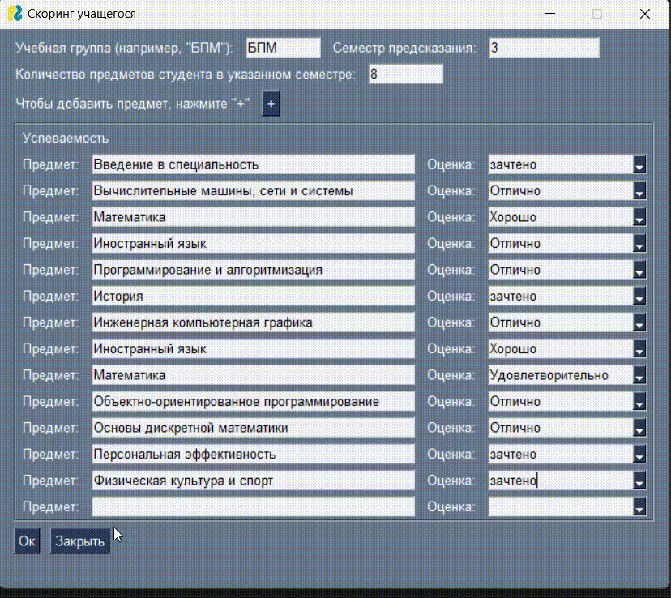
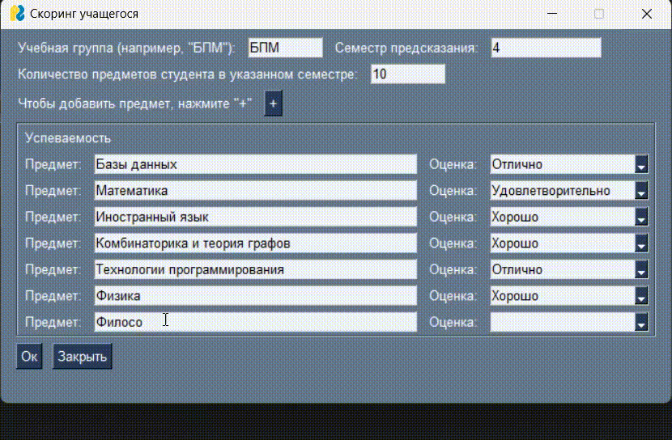

# Student Scoring App
Приложение, предоставляющее функционал предсказания количества и доли долгов на следующей сессии по предыдущим оценкам.

## Математическая постановка задачи
Предсказание количества долгов — задача регрессии, цель которой — установить связь между $`X`$ (множество всех оценок студента) и $`Y=R_{\geq 0}`$ (множество неотрицательных действительных чисел, показывающее количество неудовлетворительных оценок студента).

Пусть также задана функция потерь $`L(y,\hat{y}): Y \times Y \rightarrow R`$, которая показывает цену ошибки, если при правильном ответе $`y`$ был предсказан $`(\hat{y})`$. 

Мы будем рассматривать среднеквадратичную функцию потерь: 

```math
L(y,\hat{y}) = \sqrt{\sum\limits_{i=1}^{n} (y - \hat{y})^2 \over {n}}$$
```
**Входные данные**: $`X`$ — множество всех оценок, $`Y=R_{\geq 0}`$ — множество неотрицательных действительных чисел, показывающее количество двоек.

**Модель**: $`M(X,P)`$, $`P`$ — набор параметров модели. В нашем случае используется модель градиентного бустинга.
Она создает более сильную модель путем последовательного добавления слабых моделей (деревьев решений), каждая из которых исправляет ошибки предыдущей, что позволяет минимизировать функцию потерь.

**Результат работы модели**: $`\hat{Y} = M(X,P)`$ — предсказанное количество двоек.

## Описание набора входных данных
Первоначальный набор данных имеет следующий вид:
  
| hash                              | Номер ЛД | Уровень подготовки     | Учебная группа | Специальность/направление            | Учебный год | Полугодие   | Дисциплина                      | Оценка (без пересдач) | Оценка (успеваемость) |
| :-------------------------------- | :------- | :--------------------- | :------------- | :----------------------------------- | :---------- | :---------- | :------------------------------ | :-------------------- | :-------------------- |
| 067a80fffd8d0294a596eda117d7e393c | 2010218  | Академический бакалавр | БИВТ-20-4      | Информатика и вычислительная техника | 2020 - 2021 | I полугодие | Инженерная компьютерная графика | Хорошо                | Хорошо                |
- Всего записей: 376007
- Присутствуют записи за: '2017 - 2018', '2018 - 2019', '2019 - 2020', '2020 - 2021', '2021 - 2022', '2022 - 2023', '2023 - 2024', '2024 - 2025', '2025 - 2026', '2026 - 2027', '2027 - 2028' учебные года

Ниже будут приведены все шаги предобработки набора данных. Все действия есть в файлах jupyter notebook:
- [файл модели общего случая](notebooks/scoring_next_semester.ipynb)
- [файл модели третьего семестра](notebooks/scoring_third_semester.ipynb)

Для последующей загрузки данных в модели были произведены следующие преобразования:
- удалены записи за 2023-2028 года, т.к. для них (практически) отсутствуют оценки;
- удалены записи с учебными группами 2022 года (т.е. вида '...-22-...'), т.к. для них, в основном, есть записи только за первый курс;
- удалены записи, где оба столбца с оценкой пусты;
- добавлен столбец с семестром каждого предмета (семестр = |год группы - учебный год| * 2 + полугодие)
- вместо уровня подготовки, группы и специальности добавлен столбец 'Направление' вида 'БПМ'
- закодированы все оценки:
	- 'зачтено': 5, 'Отлично': 5,
	- 'Хорошо': 4,
	- 'Удовлетворительно': 3,
	- 'Неудовлетворительно': 2, 'Неявка': 2, 'не зачтено': 2, 'Не допущен': 2, 'Неявка по ув.причине': 2
- пропуски в промежуточной оценке заполнены двойками, при условии, что имеется итоговая оценка;
- удалены записи для студентов, для которых оценки начинаются не с первого семестра, либо заканчиваются раньше третьего
- построена сводная таблица:
	- записи сгруппированы по столбцам хэша и семестра
	- созданы столбцы для каждой дисциплины и им сопоставлены соответствующие значения из столбца промежуточной оценки
	- добавлены столбцы для каждого направления (one hot encoding), где единицей обозначено направление данного студента
Далее обработка данных отличается в зависимости от модели.
### Модель для общего случая
- было подсчитано количество двоек в каждом семестре и для соответствующей записи в столбец долгов записано количество для **следующего за ним** семестра для данного студента, т.е. для 1 семестра количество долгов за 2, для 2 за 3 и т.д.
- отброшен столбец хэша

После выполнения всех преобразований:
- Минимальное количество двоек: 0 
- Максимальное количество двоек: 15 
- Среднее количество двоек: 2.226

Итоговая таблица имеет следующий вид:

| next_sem_debts | Семестр | BIM-технологии в проектировании, строительстве и эксплуатации подземных сооружений | CAD системы в горном производстве | ... | ББИ | ... | СФП |
| -------------- | ------- | ---------------------------------------------------------------------------------- | --------------------------------- | --- | --- | --- | --- |
| 4              | 1       | 0                                                                                  | 0                                 | ..  | 1   | ... | 0   |

*18099 строк × 680 столбцов*
### Модель для предсказания двоек в третьем семестре на основе первых двух
- были удалены все записи за семестр больше третьего
- в сводной таблице записи сгруппированы по двум первым семестрам
- для каждой записи в столбец долгов записано количество двоек в **третьем** семестре для данного студента
- отброшен столбец хэша

После выполнения всех преобразований:
- Минимальное количество двоек: 0 
- Максимальное количество двоек: 11 
- Среднее количество двоек: 1.737

Итоговая таблица имеет следующий вид:

| third_sem_debts | BIM-технологии в проектировании, строительстве и эксплуатации подземных сооружений | CAD системы в горном производстве | ... | ББИ | ... | СФП |
| --------------- | ---------------------------------------------------------------------------------- | --------------------------------- | --- | --- | --- | --- |
| 6               | 0                                                                                  | 0                                 | ..  | 1   | ... | 0   |

*9985 строк × 152 столбца*
## Полученные результаты
Оба полученных набора данных были разделены на обучающую и тестовую выборку с параметрами:
- тестовая выборка составляет 25% исходного объёма данных
- параметр случайного состояния — 42.

Для решения задачи использовались модели градиентного бустинга Catboost. Гиперпараметры для каждой модели были подобраны с помощью библиотеки optuna (итерационный алгоритм TPE — Tree-structured Parzen Estimator), минимизируя среднеквадратичную ошибку.
### Модель общего случая
Обучалась с параметрами:
- количество итераций (деревьев) = 1000, 
- темп обучения = 0.16, 
- глубина дерева = 6, 
- Коэффициент L2-регуляризации для листьев деревьев = 7.85

Метрики:
- RMSE = 1.44
- R2 = 0.67
### Модель для третьего семестра
Обучалась с параметрами:
- количество итераций (деревьев) = 1000, 
- темп обучения = 0.205, 
- глубина дерева = 10, 
- Коэффициент L2-регуляризации для листьев деревьев = 1.16

Метрики:
- RMSE = 0.68
- R2 = 0.897

В приложении используются обе модели.
## Стэк использованных инструментов:
* язык программирования: Python;
* библиотека для работы с данными: Pandas;
* библиотеки для работы с машинным обучением: scikit-learn, catboost, optuna;
* библиотека для создания пользовательского интерфейса: PySimpleGUI;
* среда разработки: VS Code, Google Colaboratory.

## Установка и запуск
Чтобы запустить приложение на ОС Windows, выполните следующие шаги:
1. Склонируйте этот репозиторий:
```
git clone https://github.com/MatveyMakhrov/scoring-of-university-students.git
```
2. Перейдите в папку репозитория и создайте в ней виртуальное окружение:
```
python -m venv .
```
3. Запустите виртуальное окружение:
```
Scripts\activate
```
4. Загрузите все используемые библиотеки:
```
pip install -r requirements.txt
```
5. Запустите файл приложения:
```
python application.py
```

## Работа с приложением

На главном экране приложения, нужно указать название группы, семестр и количество предметов в данном семестре.
Далее, если нажать на кнопку "+", будут появляться новые строчки с возможностью указания предмета и оценки.
И после того, как указаны все необходимые данные студента, нужно нажать кнопку "Ок", чтобы предсказать количество долгов и их долю в указанном семестре.
В зависимости от семестра указанного пользователем вызывается соответствующая модель: 
- [модель для общего случая](notebooks/scoring_next_semester.ipynb)
- [модель для третьего семестра](notebooks/scoring_third_semester.ipynb)
После чего результат предсказания выводится на экран.



## Распределение ролей
- Product owner: Антонов Илья
- Scrum-master: Нейман Алексей
- Team: 
	- Работа с данными — Чвиков Матвей, 
	- Работа с моделями машинного обучения — Лебкова Марина, Труфманов Михаил
	- Работа с приложением — Махров Матвей, Савин Алексей
